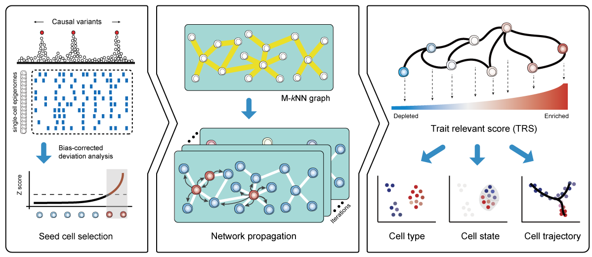

  

[-blue.svg)](https://cran.r-project.org/web/licenses/GPL%20(%3E=%202))

¶ <h4> ¶ Authors: <i>Fulong Yu, Brian Schilder</i> ¶ </h4>
<h4> ¶ README updated: <i>Jan-05-2023</i> ¶ </h4>

<!-- To modify Package/Title/Description/Authors fields, edit the DESCRIPTION file -->

### Overview:

Co-localization approaches using genetic variants and single-cell
epigenomic data are unfortunately uninformative for many cells given the
extensive sparsity across single-cell profiles. Therefore, only a few
cells from the truly relevant population demonstrate reliable phenotypic
relevance. The global high-dimensional features of individual single
cells are sufficient to represent the underlying cell identities or
states, which enables the relationships among such cells to be readily
inferred. By taking advantage of these attributes, SCAVENGE identifies
the most phenotypically-enriched cells by co-localization and explores
the transitive associations across the cell-to-cell network to assign
each cell a probability representing the cell’s relevance to those
phenotype-enriched cells via network propagation.

We developed a novel enrichment method (**SCAVENGE**) (Single Cell
Analysis of Variant Enrichment through Network propagation of GEnomic
data) that can discriminate between closely related cell types/states
and score single cells for GWAS enrichment.

Schematic view of SCAVENGE

We’ve implemented **SCAVENGE** as an `R` package for computing
single-cell based GWAS enrichments from fine-mapped posterior
probabilities and quantitative epigenomic data (i.e. scATAC-seq and
potentially other single-cell epigenome profiling methods).  
As single-cell genomic datasets grow in volume, we expect SCAVENGE will
have great promise for efficiently uncovering relevant cell populations
for more phenotypes or functions in different scenarios, which may
expand beyond the complex trait genetic variants we have examined here.
We welcome you to use SCAVENGE to discover more phenotype relevant
cells!

### Installation:
The package
can be installed directly from GitHub by typing the following in an
`R` console:

    if(!require("remotes")) install.packages("remotes")
    remotes::install_github("https://github.com/sankaranlab/SCAVENGE")
    library(SCAVENGE)

### Documentation
 
### [Website](https://sankaranlab.github.io/SCAVENGE)
### [Getting started](https://sankaranlab.github.io/SCAVENGE/articles/SCAVENGE)
This web resource and vignette compiliation shows how to reproduce results of
SCAVENGE analysis with monocyte count on a 10X PBMC dataset.

### Tutorial:

This web resource and vignette compiliation shows how to reproduce
results of SCAVENGE analysis with monocyte count on a 10X PBMC dataset
[\[**Vignette-pdf**\]](doc/SCAVENGE-vignette.pdf), [\[**Vignette-R
markdown code**\]](doc/SCAVENGE-vignette.Rmd).

See the [\[**Wiki page**\]](https://github.com/sankaranlab/SCAVENGE/wiki) for extra
information such as preparing your GWAS data for SCAVENGE (finemapping):
- [SCAVENGE] Preparing your GWAS data for finemapping
- [SCAVENGE] Preparing your scATAC-seq data
- [SCAVENGE] Rule of thumb of SCAVENGE analysis and intepretation
- [SCAVENGE-L] SCAVENGE-L method for single cell (mt)DNA mutation-based lineage tracing analysis

### [Website](https://sankaranlab.github.io/SCAVENGE)

### [Getting started](https://sankaranlab.github.io/SCAVENGE/articles/SCAVENGE)

### FAQs:

- *What input data are accepted for SCAVENGE analysis?*  
  A: The count matrix of scATAC-seq data and fine-mapped variants from
  GWAS summary statistics (we provided a tutorial for fine-mapping
  analysis from GWAS [\[**Wiki
  page**\]](https://github.com/sankaranlab/SCAVENGE/wiki)).
  Theoretically, GWAS summary statistics can be used as input but we do
  not recommend it because LD can obscure causal cell type
  identification.
- *Can I use scRNA-seq instead of scATAC-seq?*  
  A: It is not feasible for SCAVENGE analysis from scRNA-seq currently.
  We are actively developing this tool to be scalable to scRNA-seq,
  please stay tuned.
- *How can I request new feature?*  
  A: We open
  [\[**Discussions**\]](https://github.com/sankaranlab/SCAVENGE/discussions)
  page, please feel free to discuss and post your ideas.

### Citation:

If you used or adapted SCAVENGE in your study, please cite our paper
[\[*Nat
Biotechnol*\]](https://www.nature.com/articles/s41587-022-01341-y) \|\|
[\[*PubMed*\]](https://pubmed.ncbi.nlm.nih.gov/35668323/).  
*Variant to function mapping at single-cell resolution through network
propagation.*

### Contact:

If you run into issues and would like to report them, you can use the
“Issues” tab on the left hand side.  
Alternatively, you can contact authors: fyu{at}broadinstitute.org,
lcato{at}broadinstitute.org and/or sankaran{at}broadinstitute.org.
